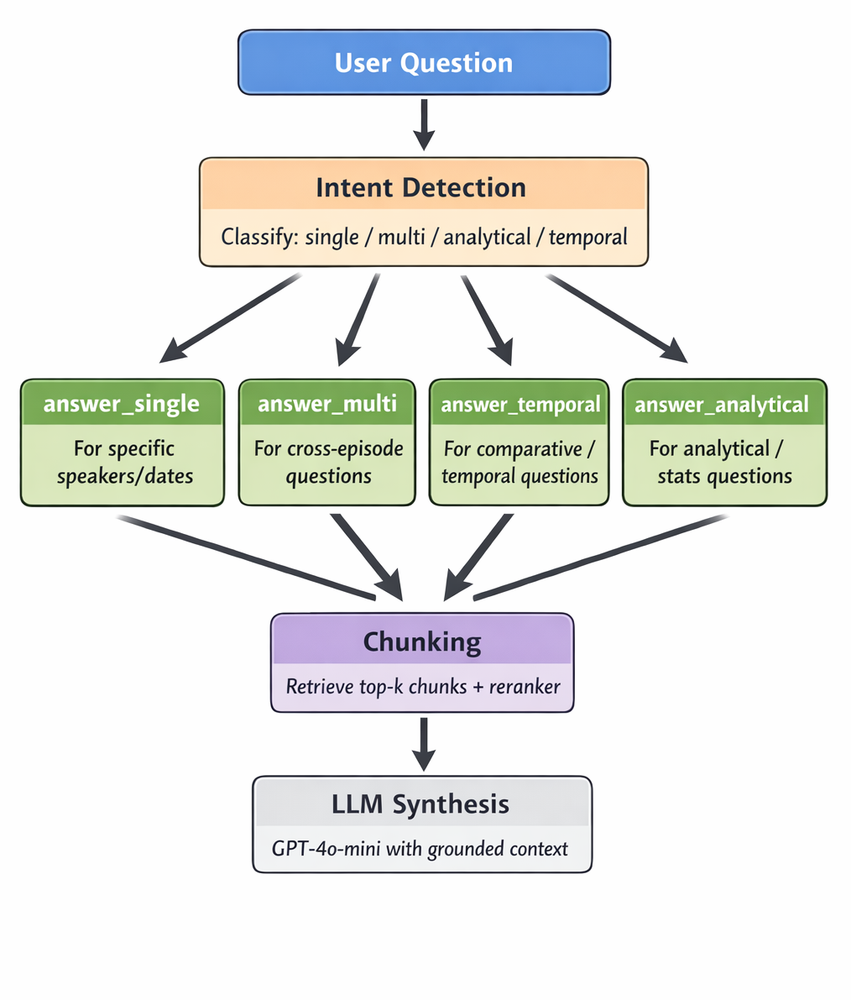

# AI Audio Transcription & Summarization

This project is a targeted backend service that processes audio from a specific company’s XML feed, generates transcriptions, and 
produces AI-powered summaries. It is designed to work alongside a dedicated frontend UI
---



## Tech Stack

| Category      | Tool                         |
| ------------- | ---------------------------- |
| Language      | Python                       |
| API Framework | FastAPI                      |
| Server        | Uvicorn                      |
| Transcription | faster-whisper               |
| NLP Models    | sentence-transformers        |
| External APIs | OpenAI                       |
| Utilities     | requests, feedparser, dotenv |

---

## Installation

### 1. Clone the repository

```bash
git clone https://github.com/arun-k-shrestha/mc-fl.git
cd mc-fl
```

### 2. Create and activate virtual environment

```bash
python -m venv venv

# macOS / Linux
source venv/bin/activate

# Windows
venv\Scripts\activate
```

### 3. Install dependencies

```bash
pip install -r requirements.txt
```

---

## 📄 Requirements

```txt
faster-whisper==1.2.1
feedparser==6.0.12
pip==25.3
requests==2.32.5
sentence-transformers==5.3.0
dotenv==0.9.9
openai==2.29.0
uvicorn==0.42.0
fastapi==0.135.1
```

---

## Running the Server

The main application file is:

```bash
server.py
```

Start the API server:

```bash
uvicorn server:app --reload
```

---


## 🔑 Environment Variables

Create a `.env` file in the root directory:

```env
OPENAI_API_KEY=your_api_key_here
```

---


## Repository

GitHub: https://github.com/arun-k-shrestha/mc-fl

---

[mc-fl-frontend](https://github.com/arun-k-shrestha/mc-fl-frontend)

The frontend provides:
- An interface for users to ask questions about processed audio
- Display of transcriptions and AI-generated summaries
- Structured output for easier interaction and exploration

>  This backend is intended to be used alongside the frontend and is not a fully standalone public API.

---

### CORS Configuration

If running the frontend and backend locally or on different domains, ensure **Cross-Origin Resource Sharing (CORS)** is properly configured in the backend.

